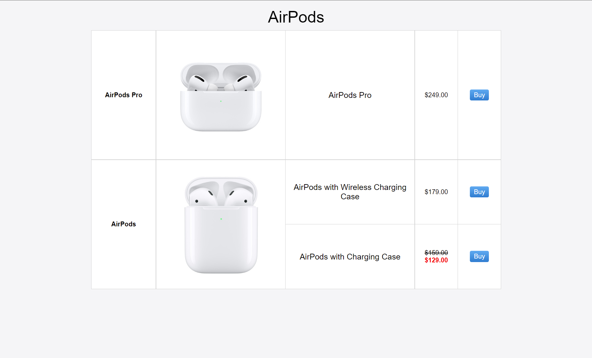
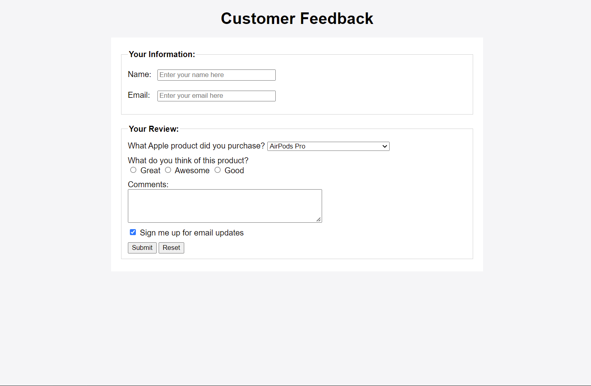
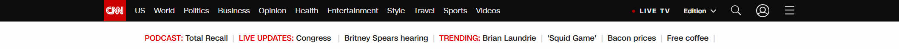

# OIM3690 Web Technologies - 2022 Summer - - Homework 2

---
**Note**: all *.html* files required below should be under folder *WebTech*. All *.css* files should be under folder *WebTech/styles*.

## General Instructions:

- This is an individual assignment.
- 10 points will be deducted for each day or partial day late. 
- There are 5 questions in this homework. You need to create multiple `.html` files and necessary `.css` files. 
- At the bottom of each `.html` file, include the Honors Code statement using **HTML comments**, "I, [your name], pledge my honor that I have neither received nor provided unauthorized assistance during the completion of this work."
- Your pages must pass [HTML validation](https://validator.w3.org/) without errors. 

## 1. Table (20 points)

Create the table shown below. You can find the picture of the products [here](images/airpods-pro.jpg) and [here](images/airpods.jpg). All styles must be done with external CSS **only**. 

- Table should be centered.
- All the text is centered, with `Arial` font.
- The heading “AirPods” is created using the `<caption>`. 
- Table border color is `lightgray`.
- The widths of columns are: `15%`, `30%`, `30%`, `10%` and `10%`.
- Use `<a>` (not button) to create "Buy" links . Each links to the real product page on apple.com or amazon.com. 
- The `background` property of the links is `linear-gradient(#51a9ee,#147bcd)` (same as Apple official website).
- Save it as `hw2-1.html` under `WebTech` folder. 

## 2. "Table" again (20 points)

Creating the "table" above (in Q1) **WITHOUT** using `table` element. All styles must be done with internal CSS or external CSS. **Inline CSS is not allowed.**
- You could use any layout approach such as **normal flow with floats**, **flexbox** or **grids**.
- All styles should be same as in Q1 (some elements could be responsive).
- Borders could be removed.
- Save it as `hw2-2.html` under `WebTech` folder.

## 3. Form (20 points)
Create the form shown below. All styles must be done with internal CSS or external CSS. **Inline CSS is not allowed.**

- Form should be centered.
- Form `method` should be `"post"` and `action` should be `"https://oim-apis.herokuapp.com/form"`.
- All the text uses `Arial` font.
- Use `<fieldset>` to group controls. Learn `<fieldset>` [here](https://developer.mozilla.org/en-US/docs/Web/HTML/Element/fieldset).
- `<fieldset>` border color is `lightgray`.
- Associate each `<label>` with corresponding `<input>`. 
- "*Sign me up for email updates*" should be pre-selected.
- Add any background color to page, and a different background color to the form.
- Save it as `hw2-3.html` under `WebTech` folder. 

## 4. *"Cloning"* Real Website Header (15 points)

Replicate the header of **ONE** of the two websites: [cnn.com](https://www.cnn.com/) and [bbc.com](https://www.bbc.com/).

- This is an individual work.
- You need to write html and CSS code **from scratch**. 
- Use the exactly same color as in original website.
- All links don't have to work. You can use `href="#"` for all the `a` tags.
- You don't have to implement the dropdown menu. However, you need to implement the effect of a link when the user mouses over it needs, for example:
  - on [cnn.com](https://www.cnn.com/), the (very light) changing color of navigation bar link, and LIVE UPDATES' turning to red
  - on [bbc.com](https://www.bbc.com/), the colorful underline effect of navigation bar link. 
  - Hint: `:hover` [selector](https://developer.mozilla.org/en-US/docs/Web/CSS/:hover).
- You don't need to implement **search** functionality. You can create an invalid link instead.
- You can use either internal CSS or external CSS (recommended). **Inline CSS is not allowed.**
- This is a very challenging task. It is acceptable if you cannot replicate the original header 100%.
- Save it as `hw2-cnn.html` or `hw2-bbc.html` under `WebTech` folder. 

## 5. Adding horizontal navbar to _index.html_ (20 points)
- You don't need to create new file.
- Remove "Contact Information" section in your original _index.html_.
- Create the horizontal navigation bar.
  - The horizontal nav bar should have multiple links, including "Home" (linking to "#" which means the current page), "GitHub" (linking to your GitHub profile page), link(s) to your social media profile(s) if any, and a dropdown menu. The text for the dropdown menu should be "Homework 2", and the dropdown options should be "hw2-1", "hw2-2", "hw2-3" and "hw2-cnn" (or hw2-bbc) which link to the corresponding webpages that you create for this homework. Check out the [example](https://www.w3schools.com/css/tryit.asp?filename=trycss_dropdown_navbar) on W3Schools. 
  - Modify CSS to stylize the horizontal nav bar appropriately.

## Submission (5 points)

1. Update *sitemap.html* by adding links to the three *.html* files.
2. ***Commit and push*** to GitHub.
3. Create a release.
  - Use tag version '`hw2`' for this release. You don't need to attach any files.
  - Learn more about [Managing releases in a repository](https://docs.github.com/en/github/administering-a-repository/releasing-projects-on-github/managing-releases-in-a-repository).

